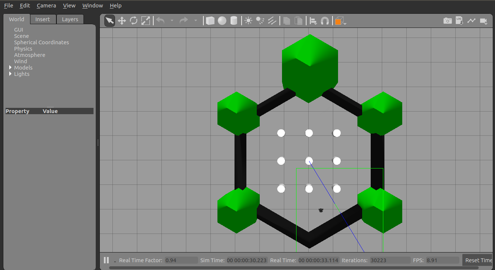
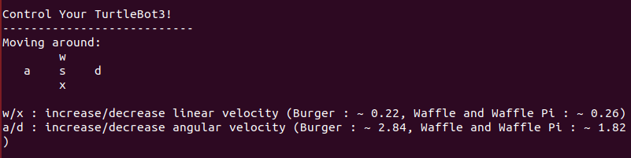

## Use Turtlebot3 with SLAM approach to create and save a map

 - SLAM (Simultaneous Localization and Mapping) is a technique to draw a map by estimating current location in an arbitrary space.

 - TurtleBot3 supports simulation development environment that can be programmed and developed with a virtual robot in the simulation. There are two development environments to do this, one is using a fake node with 3D visualization tool RViz, and the other is using the 3D robot simulator Gazebo.


### Install ROS melodic

Open the terminal and enter below commands one at a time.
```
$ sudo apt update
$ sudo apt upgrade
$ wget https://raw.githubusercontent.com/ROBOTIS-GIT/robotis_tools/master/install_ros_melodic.sh
$ chmod 755 ./install_ros_melodic.sh 
$ bash ./install_ros_melodic.sh

```

## Install Dependent ROS Packages
```
$ sudo apt-get install ros-melodic-joy ros-melodic-teleop-twist-joy \
  ros-melodic-teleop-twist-keyboard ros-melodic-laser-proc \
  ros-melodic-rgbd-launch ros-melodic-depthimage-to-laserscan \
  ros-melodic-rosserial-arduino ros-melodic-rosserial-python \
  ros-melodic-rosserial-server ros-melodic-rosserial-client \
  ros-melodic-rosserial-msgs ros-melodic-amcl ros-melodic-map-server \
  ros-melodic-move-base ros-melodic-urdf ros-melodic-xacro \
  ros-melodic-compressed-image-transport ros-melodic-rqt* \
  ros-melodic-gmapping ros-melodic-navigation ros-melodic-interactive-markers
```

## Install TurtleBot3 Packages
```
$ sudo apt-get install ros-melodic-dynamixel-sdk
$ sudo apt-get install ros-melodic-turtlebot3-msgs
$ sudo apt-get install ros-melodic-turtlebot3
```

## Set TurtleBot3 Model Name
 
  - TurtleBot3 Burger

```
$ echo "export TURTLEBOT3_MODEL=burger" >> ~/.bashrc
```
```
$ export TURTLEBOT3_MODEL=burger
$ roslaunch turtlebot3_gazebo turtlebot3_world.launch
```

## Run SLAM Node
```
$ export TURTLEBOT3_MODEL=burger
$ roslaunch turtlebot3_slam turtlebot3_slam.launch slam_methods:=gmapping
```

## Run gazebo
```
$ export TURTLEBOT3_MODEL=burger
$ roslaunch turtlebot3_gazebo turtlebot3_empty_world.launch
```


## Run Teleoperation Node

```
$ export TURTLEBOT3_MODEL=burger
$ roslaunch turtlebot3_teleop turtlebot3_teleop_key.launch
```



## Run Rviz

```
$ export TURTLEBOT3_MODEL=burger
$ roslaunch turtlebot3_slam turtlebot3_slam.launch slam_methods:=gmapping
```

## Save Map

```
$ rosrun map_server map_saver -f ~/map
```


